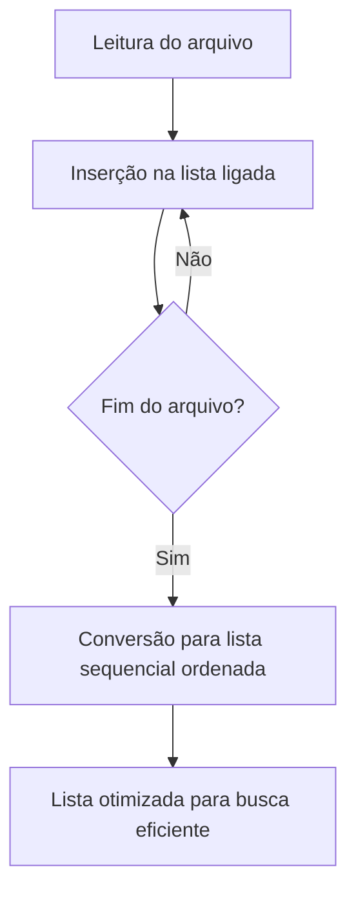
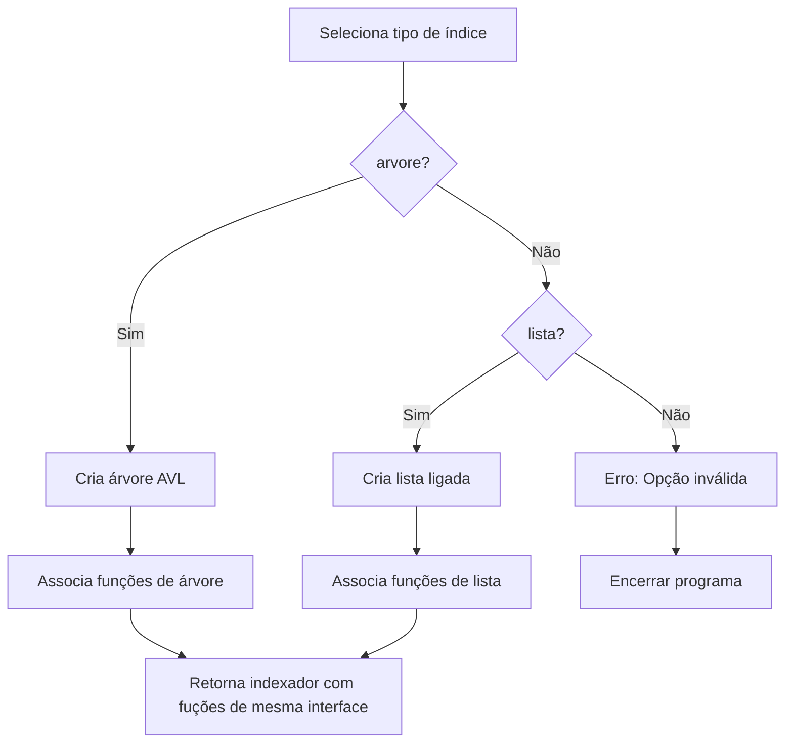

<center>ACH2023 - Algoritmos e Estruturas de Dados I</center>
<center>Exercício Programa - 2.o semestre de 2024</center>

<center><h1>Indexador e Buscador de Palavras</h1></center>
O programa carrega o conteúdo de um arquivo texto, armazena-o em memória e também indexa suas palavras. Na sequência, o programa fica à disposição do(a) usuário(a) para que ele(a) possa realizar buscas.
Caso a palavra procurada exista no texto, o programa deve exibir as linhas do texto nas quais a
palavra ocorre.

Esse código utiliza estruturas de dados base disponibilizadas durante o oferecimento da disciplina ACH2023 de 2024.

## Como compilar
Segue um exemplo de como compilar o código usando o `gcc`.
O conteúdo principal está contido no arquivo `ep.c`.
Os arquivos `lib/comparador.c`, `lib/lista_ligada.c`, `lib/lista_sequencial_ordenada.c`, `lib/lista_occ.c`, `lib/AVL.c`, `lib/indexador.c` e `lib/utils.c` também são essenciais para seu funcionamento.
Visto que a escolha do tipo de estrutura (árvore vs lista) é escolhida em _runtime_, é essencial que se compile todos os códigos-fonte juntos.

```bash
$ gcc -o ep ep.c lib/comparador.c lib/lista_ligada.c lib/lista_sequencial_ordenada.c lib/lista_occ.c lib/AVL.c lib/indexador.c lib/utils.c -lm
```

## Instruções de uso
O programa pode ser executado usando uma estrutura de lista no indexador
```bash
$ ./ep texto.txt lista
```

Ou, alternativamente, usando uma árvore como indexador
```bash
$ ./ep texto.txt arvore
```

Digite `busca <palavra>` para buscar ou `fim` para encerrar o programa.

```bash
> busca battleship
# ou
> fim
```

## Documentação técnica

### Visao geral
O programa oferece duas estratégias distintas para armazenar e buscar as palavras indexadas:

- Árvore AVL - Estrutura balanceada com busca eficiente.
- Listas - Construída a partir de uma lista ligada dinâmica, convertida posteriormente para uma lista sequencial ordenada com otimização para busca binária.

### Estratégias de Indexação

#### Árvore AVL
A árvore AVL é uma estrutura de dados balanceada que mantém a eficiência das operações de busca e inserção. Sua principal característica é o balanceamento automático após cada inserção, garantindo que a profundidade da árvore permaneça próxima a log n.

#### Funcionamento:
Durante a leitura do arquivo, cada palavra é buscada na árvore.
Se a palavra já existir, suas ocorrências são atualizadas.
Caso contrário, a palavra é inserida na árvore, criando uma nova lista de ocorrências.

#### Vantagens:
Complexidade de busca e inserção: O(log n).
Estrutura balanceada naturalmente, sem necessidade de otimizações adicionais.

---

#### Listas
A estratégia de lista é implementada em duas fases:

Fase Inicial - Lista Ligada:

Durante a leitura do arquivo, as palavras são armazenadas em uma lista ligada dinâmica.
Como o tamanho total da lista não é conhecido antecipadamente, a lista ligada permite inserções flexíveis sem realocação de memória.
A busca na lista ligada tem complexidade O(n) no pior caso, pois é necessário percorrer os elementos sequencialmente.

Fase de Otimização - Conversão para Lista Sequencial Ordenada:

Após a leitura completa do arquivo, a lista ligada é convertida em uma lista sequencial ordenada.
A lista sequencial é armazenada em um vetor dinâmico e ordenada alfabeticamente.
A busca na lista sequencial utiliza busca binária, com complexidade O(log n).



#### Vantagens:

A lista ligada facilita a construção inicial com inserções dinâmicas.
A conversão para lista sequencial ordenada otimiza o tempo de busca para O(log n).

### Estrutura de arquivos

#### indexador.c
Implementa a lógica central para gerenciamento das estruturas de indexação.



#### ep.c
Ponto de entrada do programa. Realiza a leitura do arquivo e a criação da estratégia do indexador. Realiza as operações de inserção na lista com base em uma interface compartilhada das duas estratégias (lista e AVL).

### Comparação das Estratégias

| **Critério**                 | **Árvore AVL**                    | **Lista**     |
|------------------------------|----------------------------------|----------------------------------|
| **Inserção**                 | O(log n)                         | O(n) (durante a lista ligada)    |
| **Busca Inicial**            | O(log n)                         | O(n) (lista ligada)              |
| **Busca após otimização**    | Não se aplica (já eficiente)     | O(log n) (busca binária)         |
| **Uso de Memória**           | Dinâmico, balanceado             | Dinâmico → Vetor ordenado        |
| **Flexibilidade**            | Balanceamento automático         | Precisa de otimização manual     |

## Relatório e análise
O relatório de execução e de complexidade, bem como a análise do algoritmo sujeito à variados inputs, está disponível no arquivo <a href="relatorio.pdf" target="_blank" rel="noopener">relatorio.pdf</a>.

